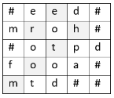

# Упражнение №12 - Подготовка за контролно 3

## Задачи

**Задача 1.** Нека двойките $(xi, yi)$ са декартови координати на точки в евклидовата равнина. Да се напише програма, която въвежда от стандартния вход естественото число $pointsNumber,$ отговарящо на брой на точки в равнината, следвано от 2 ✕ $pointsNumber$ реални числа $x0$, $y0$, $x1$, $y1$, ... $x_{pointsNumber-1}$, $y_{pointsNumber-1}$, отговарящи на декартови координати на всяка от точките и създава динамичен масив от координати. Програмата да извежда на стандартния изход координатите на горния ляв ъгъл и дължините на страните на правоъгълника с възможно най-малка площ, чиито страни са успоредни на координатните оси и който съдържа всички въведени точки.

_Пример:_ За редицата от точки $(0, 0)$, $(-1, 0)$, $(2, 1)$ програмата ще изведе -1 1 3 1.

**Задача 2.** Да се напише булева функция $convertToStrNumber$, която приема низ от малки латински букви и го преобразува на място (_inplace_) като заменя всеки негов символ с броя на неговите срещания в низа. Преобразуване на място означава, че замяната на символите се извършва директно в самия низ и за преобразуването не е позволено използването на допълнителен низ или `atoi/atof`. Низът се представя чрез масив от символи с максимален размер $1024$. Ако размерът на масива не е достатъчен за преобразуването, функцията да връща стойност “лъжа” и да не променя низа.

_Пример_: "aaabcaadcsmaabbbbsaaacc" => a -> 10; b -> 5; c -> 4; d -> 1; s -> 2; m -> 1; Низът се променя до => "101010541010142110105555210101044"

**Задача 3.** Дадена е правоъгълна матрица от символи _matrix_ с максимална размерност 50 x 50. Съседни клетки на матрицата се наричат всички клетки, които имат общ ъгъл (по един от двата диагонала). Казваме, че дума се прочита в матрица, ако буквите ѝ се съдържат в матрицата в съседни клетки. В матрицата има и непроходими клетки, които се отбелязват със знака `‘#’`.
- a). Да се напише рекурсивна функция `findWord([подходящ тип] _matrix_, char * word, [други параметри, ако са нужни])`, която по матрица и дума връща дали думата се среща в матрицата. Ако думата се среща в матрицата, символите ѝ да се заменят от знака `‘#’`.
- б). Да се напише програма, която демонстрира начина на работа на `findWord`. Програмата трябва да въвежда от клавиатурата стойност за `N` и `М` - действителните размери на матрицата, елементите на матрицата и дума с максимална дължина 50 символа. Да се използва коректен тип и да се направи валидация за горната граница на `N` и `М`. Ако стойността за `N` или `M` е невалидна, да се хвърли грешка (изключение).
- в). Да се напише функция `findAll`, която приема масив от максимум 30 низа с произволна, въведена от клавиатурата дължина, и връща дали всички думи могат да се прочетат в матрицата. Всеки символ от матрицата може да участва точно в една дума. Да се допълни програмата от б). и да се демонстрира въвеждането на данните за броя на низовете, техните дължини и стойности и работата на реализираната функция. Да се приеме, че за броя на низовете и техните дължини се въвеждат валидни неотрицателни стойности.
Да се приеме, че всяка дума може да се прочете най-много веднъж в матрицата и се състои от малки латински букви.

_Бонус:_ Да се реши в), ако е възможно дума да се прочете на повече от едно място.

Пример: думите, които се срещат в матрицата са: mother, food, dad, me, top.

