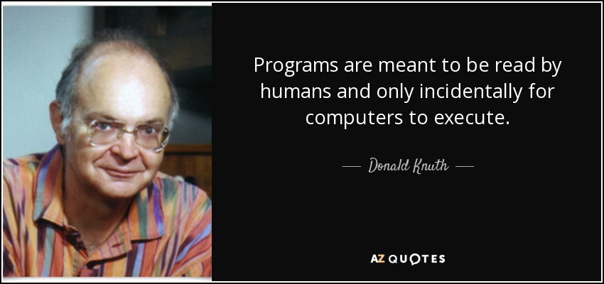
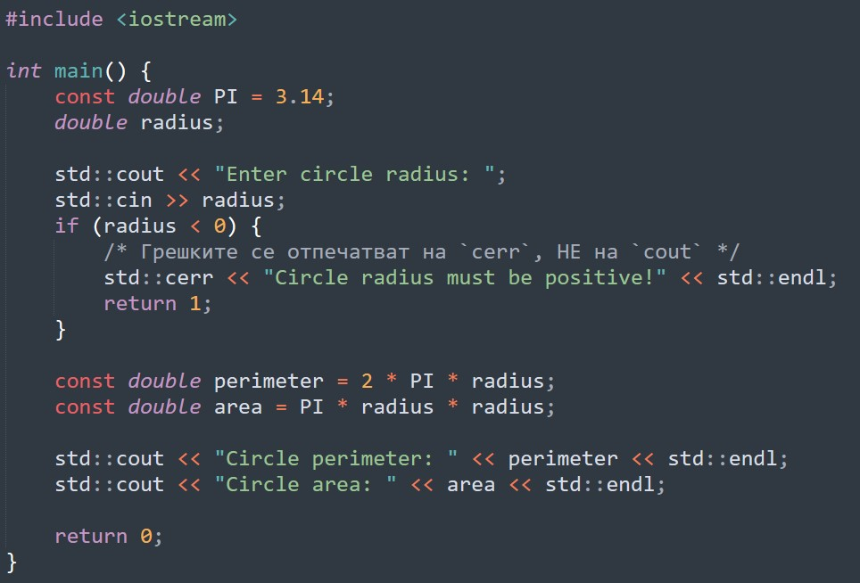

[comment]: # (Set the theme:)
[comment]: # (THEME = white)
[comment]: # (CODE_THEME = monokai-sublime)
[comment]: # (The list of themes is at https://revealjs.com/themes/)
[comment]: # (The list of code themes is at https://highlightjs.org/)
[comment]: # (Pass optional settings to reveal.js:)
[comment]: # (controls: true)
[comment]: # (keyboard: true)
[comment]: # (markdown: { smartypants: true })
[comment]: # (hash: false)
[comment]: # (respondToHashChanges: false)
[comment]: # (Other settings are documented at https://revealjs.com/config/)

# УП: КН - Група 7
------

11.10.2023

[comment]: # (!!!)

## Въпроси?

[comment]: # (!!!)

## Старческа мъдрост


[comment]: # (!!!)

## Защо?



[comment]: # (!!!)

## Цели за днес

1. Типове, Променливи, Константи
2. Оператори:
- Присвояване
- Аритметика
- Сравнение
- Логика

[comment]: # (!!!)

## Типове и Променливи

1. Кои са основните типове в С++?
2. Каква е разликата между:
  - _тип_, _променлива_ и _стойност_?
  - _променлива_ и _константа_?
  - _декларация_ и _инициализация_?
3. Какво означава _"плаваща"_ запетая?
4. Какво прави операторът `sizeof`?

[comment]: # (!!!)

#### Какво ще отпечата следния код?

```cpp
std::cout << "bool: " << sizeof(bool) << std::endl;
std::cout << "char: " << sizeof(char) << std::endl;
std::cout << "int: " << sizeof(int) << std::endl;
std::cout << "long: " << sizeof(long) << std::endl;
std::cout << "float: " << sizeof(float) << std::endl;
std::cout << "double: " << sizeof(double) << std::endl;
```

[comment]: # (!!!)

## Открийте грешките

```cpp [1|2|3|4|5]
int x = 1;
float pi = 3.14;
int gravity = 9.81;
double float mass = 1;
char c = 71;
```

[comment]: # (!!! data-auto-animate)

## Открийте грешките

```java [1|2|3|4|5]
int __context__, lock__ = 0;
double fooBarBAZ = true;
char My_Char;
char a1, b2, 3c;
double friend = 5;
```
[comment]: # (!!!)

## Оператори

- Присвояване
- Аритметика
- Сравнение
- Логика

[comment]: # (!!! data-auto-animate)

## Оператори

- Присвояване: `=`
- Аритметика
- Сравнение
- Логика

[comment]: # (!!! data-auto-animate)

## Оператори

- Присвояване: `=`
- Аритметика: `+`, `-`, `*`, `/`, `%`
- Сравнение
- Логика

[comment]: # (!!! data-auto-animate)

## Оператори

- Присвояване: `=`, `+=`, `-=`, `*=`, `/=`, `%=`
- Аритметика: `+`, `-`, `*`, `/`, `%`
- Сравнение
- Логика

[comment]: # (!!! data-auto-animate)

## Оператори

- Присвояване: `=`, `+=`, `-=`, `*=`, `/=`, `%=`
- Аритметика: `+`, `-`, `*`, `/`, `%`
- Сравнение: `==`, `!=`, `<`, `<=`, `>=`, `>`
- Логика

[comment]: # (!!! data-auto-animate)

## Оператори

- Присвояване: `=`, `+=`, `-=`, `*=`, `/=`, `%=`
- Аритметика: `+`, `-`, `*`, `/`, `%`
- Сравнение: `==`, `!=`, `<`, `<=`, `>=`, `>`
- Логика: `&&`, `||`, `!`

[comment]: # (!!! data-auto-animate)

## Оператори

- Присвояване: `=`, `+=`, `-=`, `*=`, `/=`, `%=`
- Аритметика: `+`, `-`, `*`, `/`, `%`
- Сравнение: `==`, `!=`, `<`, `<=`, `>=`, `>`
- Логика: `&&`, `||`, `!`
- Инкрементиране и декрементиране:<br/>
  `i++`, `++i`, `j--`, `--j`

[comment]: # (!!! data-auto-animate)

## Оператори

1. Каква е разликата между _приоритет_ и _асоциативност_?
2. На колко е равно:
```cpp [1|2|3|4|5|6]
1 * 2 + 3 / 4
5 / 3 + 5 % 3
6 * 3 / 2
6 / 3 / 2
10 - 9 + 1
10 - 9 - 1
```

[comment]: # (!!!)

## Въпроси?

[comment]: # (!!!)

#### Какво ще отпечата следния код?

```cpp
bool yes = true;
char a = 'a';
double pi = 3.14;

std::cout << pi + yes << std::endl;
std::cout << pi + a << std::endl;
std::cout << a + yes << std::endl;
```

[comment]: # (!!!)

#### Какво ще отпечата следния код?

```cpp
    int a = 5, b = 7;
    if (a < 10) {
        int a = 100;
        b = a + 1;
    }
    std::cout << a << ' ' << b;
```

[comment]: # (!!!)

#### Какво ще отпечата следния код?

```cpp
    double pi = 3.14;
    char a = 'a';
    if (pi < a) {
       std::cout << "Yes." << std::endl;
    } else {
       std::cout << "No." << std::endl;
    }
```

[comment]: # (!!!)

#### Какво ще отпечата следния код?

```cpp
    int a = 5, b = 7;
    if (a = b) {
        a += 1;
    }
    std::cout << a << ' ' << b;
```

[comment]: # (!!!)

#### Какво ще отпечата следния код?

```cpp
    int a = 5
    int b = (a += 7);
    std::cout << a << " " << b;
```

[comment]: # (!!!)


#### Какво ще отпечата следния код?

```cpp
    int a = 1, b = 2;
    int c = a +- b, d = a -+ b;
    std::cout << a << " " << b << " " << c << " " << d;
```

[comment]: # (!!!)

#### Какво ще отпечата следния код?

```cpp
    int a = 1, b = 2;
    int c = a++ + ++b, d = --a - b--;
    std::cout << a << " " << b << " " << c << " " << d;
```

[comment]: # (!!!)

#### Какво ще отпечата следния код?

```cpp
    int a=1, b=2, c=3*++a+b+++7%3;
    std::cout << a << " " << b << " " << c;
```

[comment]: # (!!!)

## Въпроси?

[comment]: # (!!!)

## Задачи

[comment]: # (!!!)

## Правила на играта

1. Използваме _**само**_ вече взетия материал
2. Цяло число $\rightarrow$ `int`
3. Положително число $\rightarrow$ `unsigned` ~`int`~
4. Реално число $\rightarrow$ `double` ~`float`~
5. Съобщения за грешка $\rightarrow$ `std::cerr` ~`std::cout`~
6. Изход при грешка $\rightarrow$ `return 1;` ~`return 0;`~

[comment]: # (!!!)

## Защо?

1. _"Добри практики"_
2. Ще разберете по-нататък в курса ... или догодина по _ОС_

[comment]: # (!!!)

## Пример



[comment]: # (!!!)

## Задачи

1. Аритметика и логика: 1-5
2. Дигитален часовник: 12
3. Условни оператори: 15, 16

[comment]: # (!!!)
