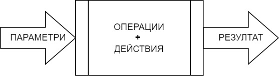
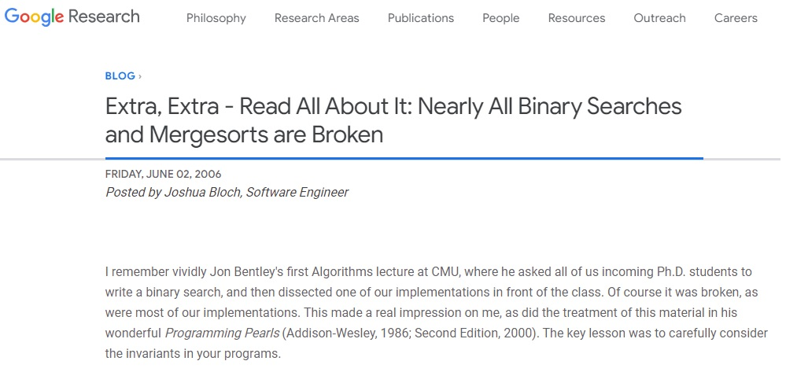

[comment]: # (Set the theme:)
[comment]: # (THEME = white)
[comment]: # (CODE_THEME = github)
[comment]: # (The list of themes is at https://revealjs.com/themes/)
[comment]: # (The list of code themes is at https://highlightjs.org/)
[comment]: # (Pass optional settings to reveal.js:)
[comment]: # (controls: true)
[comment]: # (keyboard: true)
[comment]: # (markdown: { smartypants: true })
[comment]: # (hash: false)
[comment]: # (respondToHashChanges: false)
[comment]: # (Other settings are documented at https://revealjs.com/config/)

# УП: КН - Група 7
------

25.10.2023

[comment]: # (!!!)

## Въпроси?

[comment]: # (!!!)

## Цели за днес

1. Функции
2. Изключения
3. Полезни хедър файлове

[comment]: # (!!!)

## Функции

1. Какво?
2. Защо?
3. Как?

[comment]: # (!!! data-auto-animate)

## Функции

> Двойно просто число е просто число, чийто сбор от цифри също е просто число. Изведете всички двойно прости числа в интервала [a, b].

[comment]: # (!!! data-auto-animate)

## Функции

```cpp
// Ако вече имаме функциите `sumDigits` и `isPrime`
bool isDoublePrime(unsigned n) {
    return isPrime(n) && isPrime(sumDigits(n));
}

void printDoublePrimes(unsigned a, unsigned b) {
    for (unsigned i = a; i <= b; i++) {
        if (isDoublePrime(i)) {
            std::cout << i << std::endl;
        }
    }
}
```
[comment]: # (!!! data-auto-animate)

## Функции



[comment]: # (!!! data-auto-animate)

## Функции

1. Декомпозиция на _**по-прости**_ под-проблеми.
2. Разпределяне и паралелизация на работата.
3. Споделяне и преизползване на кода: пиша **веднъж**, тествам **веднъж**, използвам **навсякъде**.
4. Функциите са най-важната абстракция в програмирането!

[comment]: # (!!!)

## Функции

- Декларация _vs._ Дефиниция
- Формални _vs._ Фактически параметри

[comment]: # (!!! data-auto-animate)

## Функции

- Декларация:

```cpp
int square(int x);
```

- Дефиниция:

```cpp
int square(int x) {
    return x * x;
}
```

[comment]: # (!!! data-auto-animate)

## Функции

- Формални параметри:

```cpp
int square(int x);
```

- Фактически параметри:

```cpp
std::cout << square(0) << std::endl;
for (int i = 1; i <= 10; i ++) {
    std::cout << square(i) << std::endl;
}
```

[comment]: # (!!!)

## Изключения

1. Какво?
2. Защо?
3. Как?

[comment]: # (!!! data-auto-animate)

## Изключения

```cpp
int foo() { return bar(); }
int bar() { return baz(); }
int baz() { return boom(); }
int boom() { /* Тук се случва грешка */ }
```

- Как да върна едновременно грешка и резултат?
- Как да предам лесно грешката _"по веригата"_?

[comment]: # (!!! data-auto-animate)

## Изключения

```cpp
int foo() {
    try {
        return bar();
    } catch(std::exception& e) {
        // Handle exception ...
    }
}
int bar() { return baz(); }
int baz() { return boom(); }
int boom() { throw std::exception(); }
```

[comment]: # (!!! data-auto-animate)

## Изключения

Изключенията ни позволяват да _"скочим"_ от едно място в кода (`throw`) на друго (`catch`), заобикаляйки нормалния ред на изпълнение (_control flow_) на кода.

[comment]: # (!!! data-auto-animate)

## Изключения

- Да се _**отпечата**_ грешка $\rightarrow$ `std:cerr << ...`
- Да _**хвърли**_ грешка $\rightarrow$ `throw ...`
  - Visual Studio: `throw std::exception(...);`
  - GCC: `throw std::runtime_error(...);`
    - `#include <stdexcept>`
- _**Винаги**_ хващайте изключенията в `main`!

[comment]: # (!!! data-auto-animate)

## Полезни хедър файлове

[comment]: # (!!! data-auto-animate)

## `<cassert>`

- Дефиниция на `assert`

```cpp
assert(<condition>);
```

=> `<condition>` ТРЯБВА да е вярно!

[comment]: # (!!!)

## `<cmath>`

- Полезни математически функции
  - `pow`, `sqrt`, `abs`
  - `exp`, `log`, `log10`, ...
  - `sin`, `cos`, ...
  - `ceil`, `floor`
  - _и други_ ...

[comment]: # (!!!)

## `<climits>`

- Мин. и Макс. стойности на целочислени типове
  - `INT_MIN`, `INT_MAX`
  - `UINT_MAX` (`UINT_MIN` ???)
  - `LONG_MIN`, `LONG_MAX`
  - _и други_ ...

[comment]: # (!!!)

## `<stdexcept>`

- `std::invalid_argument("Message")`
- `std::runtime_error("Message")`

[comment]: # (!!!)

## `<iomanip>`

- Различни манипулатори за форматирането на входните и изходните данни:
  - `setprecision`, `setfill`, `setw`
  - `fixed`, `scientific`
  - `boolalpha` (отпечатва true/false вместо 1/0).

[comment]: # (!!!)

#### Какво ще отпечата следния код?

```cpp
int a = 5, b = 7, c = 2;
int d = ++(c = a + b);

std::cout << a << b << c << d;
```

[comment]: # (!!!)

#### Какво ще отпечата следния код?

```cpp
int a = 1234567890;
float f = a;
int b = f;
std::cout << (a == b) << std::endl;
```

[comment]: # (!!!)

#### Какво ще отпечата следния код?

```cpp
int a = 1234567890
int b = 2 * a / 2;
std::cout << b << std::endl;
```

```cpp
int a = 1234567890, b = a + 1;
std::cout << (a + b) / 2 << std::endl;
```

[comment]: # (!!!)

#### Защо да ви пука?



[comment]: # (!!!)

#### Какво ще отпечата следния код?

```cpp
int twice(int x) {
    if (x < 0) {
        throw std::invalid_argument("x must be positive!");
    }
    return 2*x;
}

int main(void) {
    try {
        std::cout << twice(-1) << twice(1) << std::endl;
        return 0;
    } catch(std::exception& e) {
        std::cerr << e.what() << std::endl;
        return 1;
    }
}
```
[comment]: # (!!! data-auto-animate)

#### Какво връща функцията?

```cpp
int f(unsigned n) {
    int res = 1;
    do {
        res *= n % 10;
        n /= 10;
    } while(n);
    return res;
}
```

[comment]: # (!!!)

#### Какво връща функцията?

```cpp
int g(unsigned n) {
    int res = 0;
    for (; n > 0; res += n % 10, n /= 10);
    return res;
}
```

[comment]: # (!!!)

#### Открийте буболечката

```cpp
bool isPrime(int n) {
    if (n < 2) {
        return false;
    }
    for (int i = 2; i < n / 2; ++i) {
        if (n % i == 0) {
            return false;
        }
    }
    return true;
}
```
[comment]: # (!!!)

## Въпроси?

[comment]: # (!!!)

## Задачи

- **Всичките** ;)
- _Предизвикателство_: 11, 12.

[comment]: # (!!!)
