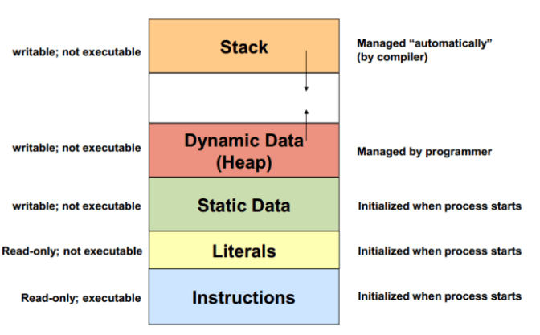

[comment]: # (Set the theme:)
[comment]: # (THEME = white)
[comment]: # (CODE_THEME = github)
<!-- [comment]: # (CODE_THEME = monokai-sublime) -->
[comment]: # (The list of themes is at https://revealjs.com/themes/)
[comment]: # (The list of code themes is at https://highlightjs.org/)
[comment]: # (Pass optional settings to reveal.js:)
[comment]: # (controls: true)
[comment]: # (keyboard: true)
[comment]: # (markdown: { smartypants: true })
[comment]: # (hash: false)
[comment]: # (respondToHashChanges: false)
[comment]: # (Other settings are documented at https://revealjs.com/config/)

# УП: КН - Група 7
------

22.11.2023

[comment]: # (!!!)

## Въпроси?

[comment]: # (!!!)

#### Какво ще отпечата следния код?

```cpp
int a = -1;
unsigned b = 0;

if (a < b) {
    std::cout << "A: " << (a - b) << std::endl;
} else {
    std::cout << "B: " << (a - b) << std::endl;
}
```

[comment]: # (!!!)

## Цели за днес:
<br/>

### Динамична памет

[comment]: # (!!!)

### Пример

```cpp
int a[10];

int main() {
    int b[100];
    int *c = new int[1000];

    std::cout << ' ' << a << ' ' << b << ' ' << c << std::endl;
    std::cout << ' ' << a[0] << ' ' << b[0] << ' ' << c[0] << std::endl;

    return 0;
}
```

[comment]: # (!!!)

### Heap _vs_ Stack



[comment]: # (!!!)

### Скаларни променливи

```cpp
const int *i  = new int;
const double * const PI = new double(3.14);

// Cleanup:
delete i;
delete PI;
```

[comment]: # (!!!)

### Едномерни масиви

```cpp
size_t size;
std::cin >> size;

int *dynamicArray = new int[size];
for (size_t i = 0; i < size; i ++) {
    std::cin >> dynamicArray[i];
}

// Cleanup:
delete[] dynamicArray;
```

[comment]: # (!!!)

### Многомерни масиви 1

```cpp
size_t size;
std::cin >> size;

double (*points3D)[3] = new double[size][3];
for (size_t i = 0; i < size; i ++) {
    std::cout << "Enter x, y, z coordinates: ";
    std::cin >> points3D[i][0] >> points3D[i][1] >> points3D[i][2];
}

// Cleanup:
delete[] points3D;
```
[comment]: # (!!!)

### Многомерни масиви 2

```cpp
size_t m, n;
std::cin >> m >> n;

int **matrix = new int*[m];
for (size_t i = 0; i < m; i ++) {
    matrix[i] = new int[n];
    // ...
}

// Cleanup:
for (size_t i = 0; i < m; i ++) {
    delete[] matrix[i];
}
delete[] matrix;
```

[comment]: # (!!!)

### Memory leaks 1

```cpp
int *array = new int[10];
delete array;
```

[comment]: # (!!!)

### Memory leaks 2

```cpp
int *xs = new int[10], *ys = new int[20];
xs = ys;

delete[] xs;
delete[] ys;
```

[comment]: # (!!!)

## Въпроси?

[comment]: # (!!!)

#### Какво прави следния код?

```cpp
size_t size;
std::cin >> size;

int *dynamicArray = new int[size];
for (size_t i = 0; i < size; i ++) {
    std::cin >> dynamicArray[i];
}
```

[comment]: # (!!!)

#### Какво ще отпечата следния код?

```cpp
void foo(char arr[]) {
    size_t len = sizeof(arr[1000]);
    std::cout << len << std::endl;
}

// main()
foo(nullptr);
```

[comment]: # (!!!)

#### Какво ще отпечата следния код?

```cpp
void foo(char arr[]) {
    size_t len = sizeof(arr) / sizeof(char);
    std::cout << len << std::endl;
}

// main()
char arr[4] = {'a', 'b', 'c', 'd'};
foo(arr);
```

[comment]: # (!!!)

#### Какво ще отпечата следния код?

```cpp
size_t a;
std::cin >> a;

std::cout << new int[a];
```

[comment]: # (!!!)

#### Какво ще отпечата следния код?

```cpp
size_t a, b;
std::cin >> a >> b;

std::cout << new int[a][b];
```

[comment]: # (!!!)

#### Открийте буболечките

```cpp
int **arr = new int*[10];
for (int i = 0; i < 10; i++) {
    arr[i] = new int(i);
}
delete arr;
```

[comment]: # (!!!)

#### Открийте буболечките

```cpp
    int sum;
    do {
        unsigned num;
        std::cin >> num;
        if (isSpecial(num)) {
            sum += num;
        }
    } while (num != 0);
```

[comment]: # (!!!)

#### Открийте буболечките

```cpp
bool areAnagrams(char *word1, char *word2, size_t size) {
    size_t count = 0;
    for (size_t i = 0; i < size; i++) {
        for (size_t j = 0; j < size; j++) {
            if (word1[i] == word2[j]) {
                count ++;
            }
        }
    }
    return (count == size);
}
```

[comment]: # (!!!)

## Въпроси?

[comment]: # (!!!)

## Задачи:

- 1 - на лист
- 2-6 - на компютър

[comment]: # (!!!)
