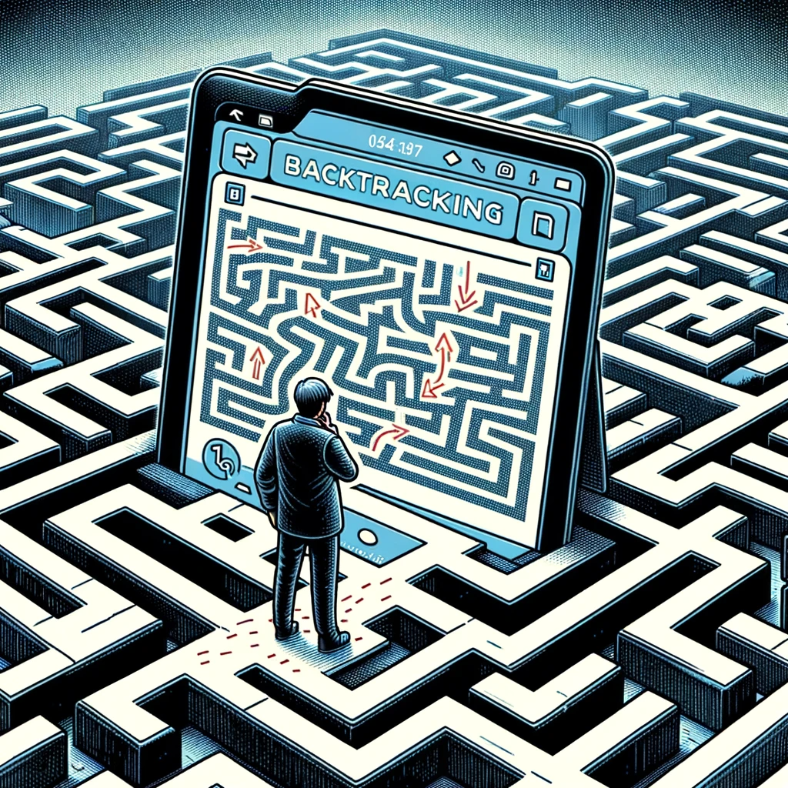

[comment]: # (Set the theme:)
[comment]: # (THEME = white)
[comment]: # (CODE_THEME = github)
<!-- [comment]: # (CODE_THEME = monokai-sublime) -->
[comment]: # (The list of themes is at https://revealjs.com/themes/)
[comment]: # (The list of code themes is at https://highlightjs.org/)
[comment]: # (Pass optional settings to reveal.js:)
[comment]: # (controls: true)
[comment]: # (keyboard: true)
[comment]: # (markdown: { smartypants: true })
[comment]: # (hash: false)
[comment]: # (respondToHashChanges: false)
[comment]: # (Other settings are documented at https://revealjs.com/config/)

# УП: КН - Група 7
------

20.12.2023

[comment]: # (!!!)

## Въпроси?

[comment]: # (!!!)

## Забележки:

- Спазвайте условието на задачата
- Рекурсия означава _**рекурсия**_!

[comment]: # (!!!)

### Цели за днес

 <!-- .element: style="height:520px;" -->

[comment]: # (!!!)

### Защо ни е?

- За решаване на проблеми свързвани с _"удовлетворяване на ограничения"_ (_constraint satisfaction problems_)
- В основата на логическото програмиране и _"класическия" AI_
- За интервюта в _"готините"_ компании
- За контолното и изпита по УП

[comment]: # (!!!)

### Как работи?

1. Пробваме да видим докъде можем да стигнем
2. Ако сме стигнали до края: 🥳🍾🥳🍾🥳
3. Ако не: връщаме се до последния _"кръстопът"_ и пробваме _**нещо различно!**_
4. Ако сме изпробвали всички възможности: 😢

[comment]: # (!!!)

### Пример: Изход от лабиринт

[comment]: # (!!!)

### Пример: Изход от лабиринт

 <!-- .element: style="height:560px;" -->

[comment]: # (!!!)

## Въпроси?

[comment]: # (!!!)

## Задачи:

 
Опитайте се да решите всички задачи от това и предното упражнения.

[comment]: # (!!!)
