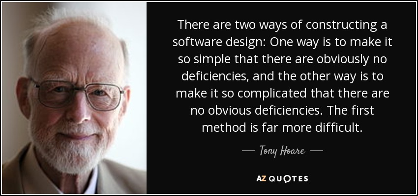

[comment]: # (Set the theme:)
[comment]: # (THEME = white)
[comment]: # (CODE_THEME = github)
[comment]: # (The list of themes is at https://revealjs.com/themes/)
[comment]: # (The list of code themes is at https://highlightjs.org/)
[comment]: # (Pass optional settings to reveal.js:)
[comment]: # (controls: true)
[comment]: # (keyboard: true)
[comment]: # (markdown: { smartypants: true })
[comment]: # (hash: false)
[comment]: # (respondToHashChanges: false)
[comment]: # (Other settings are documented at https://revealjs.com/config/)

# УП: КН - Група 7
------

03.01.2024

[comment]: # (!!!)

## Въпроси?

[comment]: # (!!!)

## Контролно 3

- По един `.cpp` файл на задача
- Предавате `zip` файл в **moodle**: `group7_<Факултетен_номер>_<А|B>.zip`

[comment]: # (!!!)

## Общи Съвети

1. Наспете се, пийте кафе, елате навреме ...
2. Носете зарядно, разклонител, ...
3. Прочетете ВНИМАТЕЛНО условието
4. Започнете от лесното към трудното
5. Тествайте _**граничните случаи**_!
6. Пишете **_"четим_"** код

[comment]: # (!!!)

## От Контролно 2

1. **Връщайте** резултата, НЕ го печатайте!
2. Низ = `char*` без размер! (Използвайте `strlen`)
3. Не забравяйте за `'\0'`!
4. Kога слагаме `&` и кога не?
5. Търсете по-_прости_ решения ...

[comment]: # (!!!)

## Старческа мъдрост

[comment]: # (!!!)

## Въпроси?

[comment]: # (!!!)

## Задачи

- 1, 2, 3
- Предайте, докъдето сте стигнали!

[comment]: # (!!!)
